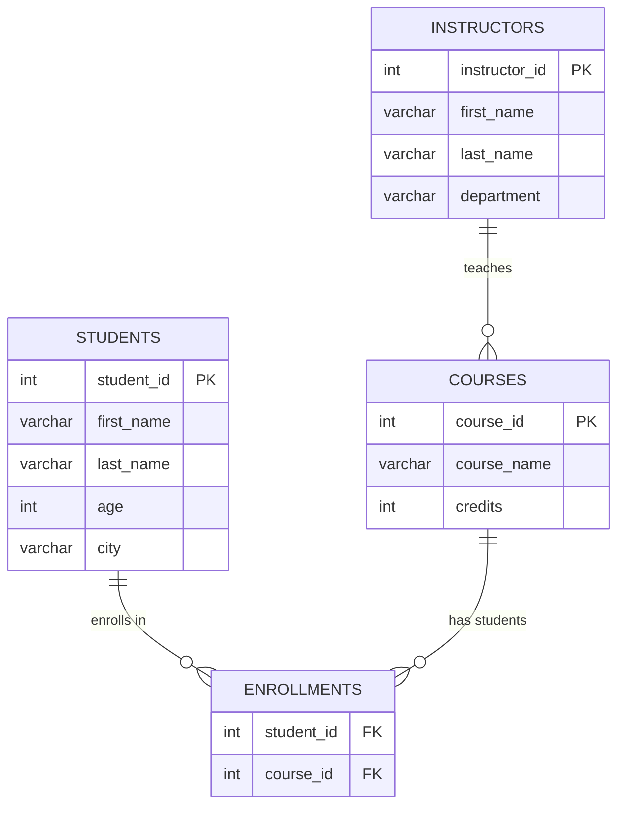

# LAB 1 SOLUTION

the following paragraphs will contain a step by step solution on how to recreate the desired data.

## Questions 1 - 5 
the solution to this part is presented in the [lab1.sql](https://github.com/zakaria-with-glasses/DBMS_labs/blob/main/lab1.sql)

## Questions 6-7-8
to insert the desired table content i will do the to each of the tables respectively
```sql
	-- for the students table:
	INSERT INTO Students(first_name, last_name, age, city)
	VALUES
				('zakaria', 'with-glasses', 999, "Sharks"),
				("john", "doe", 25, "NYC"),
				("jack", "Daniel", 107, "NYC"),
				("Leo", "sam", 26, "NYC");
	
	-- for the courses table:
	INSERT INTO Courses(course_name, credits)
	VALUES
				('Analysis 3', 100),
				("DBMS", 100),
				('ALGEBRA 3', 100),
				('DSA', 100);
	
	-- for the instructors table:
	INSERT INTO Instructors(first_name, last_name, departement) 
	VALUES 
				('karima', 'echihabi', 'CC'), 
				('taha', 'elbakkali', 'CC'), 
				('younes', 'el  mortaki', 'CC')
				('someone', 'else', 'emines');

	-- for the enrollments table:
	INSERT INTO Enrollments(student_id, course_id, semester)
	VALUES	(1, 1, 3),
			(1, 2, 3),
			(1, 3, 3),
			(1, 4, 3),
			(2, 1, 3),
			(2, 4, 3);
```
---
Now since the all the data has been set up an linked together, 
i will give a visual cue on how our database looks like.



