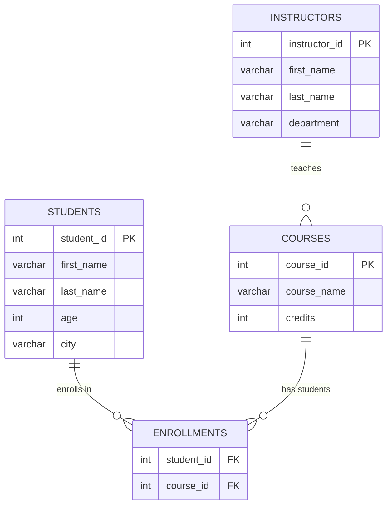

# LAB 1 SOLUTION

the following paragraphs will contain a step by step solution on how to recreate the desired data.

## Questions 1 - 5 
the solution to this part is presented in the [lab1.sql](https://github.com/zakaria-with-glasses/DBMS_labs/blob/main/lab1.sql)

## Questions 6-7-8
to insert the desired table content i will do the to each of the tables respectively
```sql
	-- for the students table:
	INSERT INTO Students(first_name, last_name, age, city)
	VALUES
				('zakaria', 'with-glasses', 999, "Sharks"),
				("john", "doe", 25, "NYC"),
				("jack", "Daniel", 107, "NYC"),
				("Leo", "sam", 26, "NYC");
	
	-- for the courses table:
	INSERT INTO Courses(course_name, credits)
	VALUES
				('Analysis 3', 100),
				("DBMS", 100),
				('ALGEBRA 3', 100),
				('DSA', 100);
	
	-- for the instructors table:
	INSERT INTO Instructors(first_name, last_name, departement) 
	VALUES 
				('karima', 'echihabi', 'CC'), 
				('taha', 'elbakkali', 'CC'), 
				('younes', 'el  mortaki', 'CC')
				('someone', 'else', 'emines');

	-- for the enrollments table:
	INSERT INTO Enrollments(student_id, course_id, semester)
	VALUES	(1, 1, 3),
			(1, 2, 3),
			(1, 3, 3),
			(1, 4, 3),
			(2, 1, 3),
			(2, 4, 3);
```
---
Now since the all the data has been set up an linked together, 
i will give a visual cue on how our database looks like.


this gives us an overview on how our database should look like;
we can then proceed to execute each of the queries mentioned in the problem.
### Query 1:
```sql
SELECT * from Students;
```
- Explanation: Select all columns from the table "Students" (SQL is not case sensitive)
### Query 2:
```sql
SELECT course_name FROM Courses;
```
- Explanation: we only want a (column) thus we only select one.
### Query 3:
```sql
SELECT * from Students WHERE age >= 20;
```
- Explanation: the "WHERE" selector allows filtered queries throughout our designated table.
### Query 4:
```sql
SELECT * from Instructors WHERE departement = 'CC';
```
- Explanation Not required.
### Query 5:
```sql
SELECT first_name, last_name, course_name FROM enrollments AS e
 JOIN students AS s ON s.student_id = e.student_id 
 JOIN courses AS c ON c.course_id = e.course_id ;
```
- Explaination: the concept used in this part is the concept of joins in SQL ,
	- the concept similar to operations on sets where you can do a left join, inner join right join:	
	

	when i do the join on each of the components i am requesting each of the ids from their respective table to be able to create my own custom table that contains (first_name, last_name, course_name) as columns.

### Query 6:
```sql
SELECT DISTINCT city FROM Students;
```
- Explanation: the DISTINCT keyword returns a table containing the set of cities with no repetition, similar result can be reproduced using GROUP BY.

### Query 7:
```sql
SELECT COUNT(*) as row_size FROM Students;
```
- Explanation: The COUNT built-in fuction returns the count of how many columns in a table. the returned value will be put alone in a table with one column name: "row_size".
### Query 8:
```sql
SELECT AVG(age) as average_age FROM STUDENTS;
```

- Explanation: we can calculate the average of all values of a column using the function AVG(column_name).

### Query 9:
```sql
SELECT * FROM Students WHERE first_name='S%';
```
- Explanation: the intricate thing about this query is the regular expression which is SQL specific:
   - the regex goes this way: "pattern%" here the percentage character serves as a wildcard used by the DBMS engine to fill in the values for this pattern.
### Query 10:
```sql
SELECT * FROM Students WHERE 20<= age <= 22;
```
- No Explanation needed.
### Query 11:
```sql
SELECT * FROM Students ORDER BY city ASC, age DESC;
```
- Explanation: the ORDER BY keyword works by getting a column name and then specifying the order.

### Query 12:
```sql
SELECT * FROM Students LIMIT 2;
```
- Explanation: the LIMIT keyword allows rate limiting for queries to avoid over-fetching.

### Query 13:
```sql
SELECT semester, COUNT(*) as enrollment_count FROM Enrollments GROUP BY semester;
```
- Explanation:the GROUP BY operator allows us to split each of the semesters into sets and then count the number of rows that are in the smae semester.
